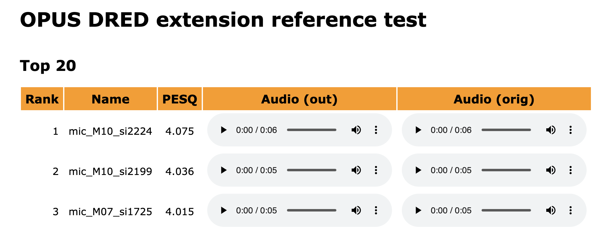
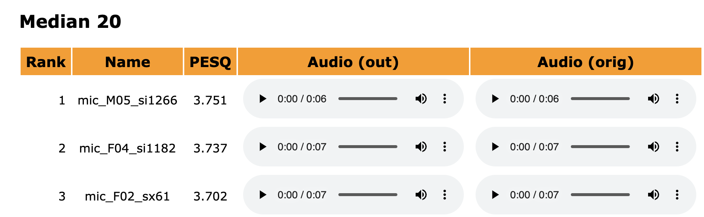
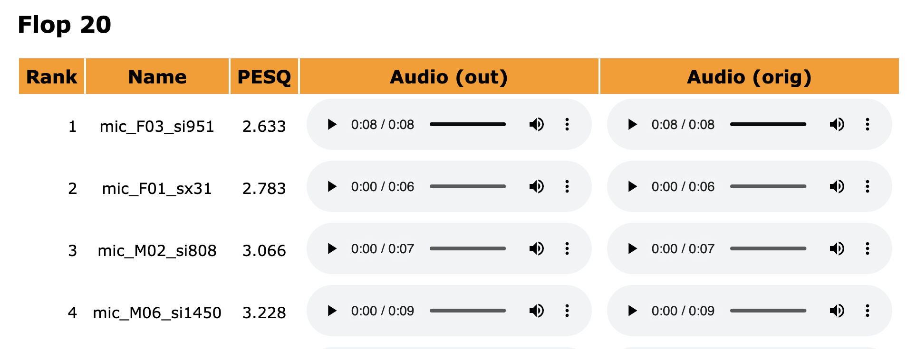
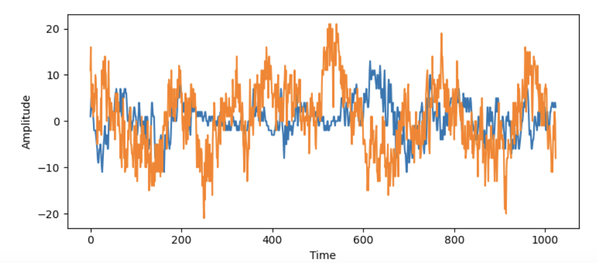

# IETF117-OPUS-APPLICATION
Application of Deep Audio Redundancy (DRED) Extension in Opus for IETF117 Hackathon 

For usecase of spike in loss ( heavy jitter ) such as burtsy network which could be a result of NAT rebinding or network handover, the Audio Code needs to be resistant to heavy loss. This can be achieve by the DREAD extension of OPUS codec.

**Deep Audio Redundancy (DRED) Extension for the Opus Codec
draft-valin-opus-dred-01**
Source : https://datatracker.ietf.org/doc/draft-valin-opus-dred/

## DataSet 

**Sinngle File**
StarWars60.wav
source: -

**PTDB-TUG**
size:4GB
source: https://www2.spsc.tugraz.at/databases/PTDB-TUG/

**Large dataset CSTR VCTK Corpus: English Multi-speaker Corpus for CSTR Voice Cloning Toolkit**
size:10 GB
source: https://datashare.ed.ac.uk/handle/10283/2651

## OPUS build from source 

Get the OPUS Source Code : https://gitlab.xiph.org/xiph/opus
checkout to branch opus-ng

### Set up the virtual Env

    conda create -n env-opus-ng python=3.10
    conda activate 

**prerequisites**

    brew install sox

Navigate to the folder DNN/torch/testsuite

### See Scores

Using PESQ (Perceptual Evaluation of Speech Quality)  for evaluating the decoded stream from sample 

    cat scores_pesq.txt

examnple :

    0	mean score	1.828776
    1	bottom mean score	1.449803
    2	top mean score	2.349781

See Visual Results 
    open html/pesq/index.html

Top 20 

Median 

Flop

### WaveForms overlaying  real and synthetic file 

$${\color{red}Note : }$$ 
None of these metrics are credible ways of eveluating the performance of OPUS with DRED extension. There is an incomplete attempt to inetgarting this with Gstreamer encoder and decoder. 

## Run as gstreamer 

OPUS is supported as base plugin on gstreamer 
https://gstreamer.freedesktop.org/documentation/opus/index.html?gi-language=c

opus (from GStreamer Base Plug-ins)
Name	Classification	Description
opusdec	Codec/Decoder/Audio/Converter	decode opus streams to audio
opusenc	Codec/Encoder/Audio	Encodes audio in Opus format

To run the gst pipeline  With DRED (Deep REDundancy) use meson 
https://gstreamer.freedesktop.org/documentation/installing/building-from-source-using-meson.html?gi-language=c

Compile this branch https://github.com/altanai/gst-build/tree/master
( Note : This is work in progress and not ready from Decoder side yet)
